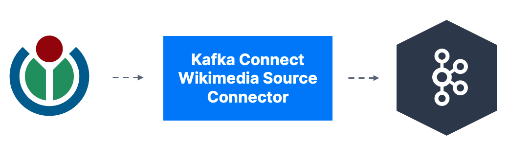

# Kafka Connect Wikimedia

[](https://github.com/conduktor/kafka-connect-wikimedia/actions/workflows/ci.yml)

A Kafka Connect Source connector that streams real-time events from [Wikimedia's EventStreams](https://stream.wikimedia.org/v2/stream/recentchange) into Kafka topics.



## Features

- Streams Wikimedia recent changes (edits, new pages, etc.) in real-time
- Configurable reconnection handling
- Custom User-Agent header support (required by Wikimedia API)
- Dead letter queue support for error handling

## Installation

Download the JAR from [Releases](https://github.com/conduktor/kafka-connect-wikimedia/releases) and place it in your Kafka Connect plugins directory.

## Configuration

| Property | Required | Default | Description |
|----------|----------|---------|-------------|
| `topic` | Yes | - | Kafka topic to publish events to |
| `url` | Yes | - | Wikimedia EventStream URL |
| `reconnect.duration` | No | `3000` | Reconnection delay in milliseconds |
| `http.headers.user.agent` | No | `WikimediaKafkaConnector/1.0` | User-Agent header for HTTP requests |

### Example Configuration

```properties
name=wikimedia-source-connector
tasks.max=1
connector.class=io.conduktor.demos.kafka.connect.wikimedia.WikimediaConnector
topic=wikimedia.recentchange
url=https://stream.wikimedia.org/v2/stream/recentchange
http.headers.user.agent=MyApp/1.0 (contact@example.com)
```

See [connector/wikimedia.properties](connector/wikimedia.properties) for a complete example.

## Building from Source

Requires Java 11+.

```bash
./gradlew shadowJar
```

Output: `build/libs/kafka-connect-wikimedia-<version>-all.jar`

## Local Development

A Docker Compose setup is provided for local testing.

### Quick Start

```bash
# Build the connector
./gradlew shadowJar

# Start Kafka + Connect
docker compose up -d

# Wait for Connect to be ready (~20s)
curl http://localhost:8083/connector-plugins | grep -i wikimedia

# Deploy the connector
curl -X POST http://localhost:8083/connectors \
  -H "Content-Type: application/json" \
  -d '{
    "name": "wikimedia-source",
    "config": {
      "connector.class": "io.conduktor.demos.kafka.connect.wikimedia.WikimediaConnector",
      "tasks.max": "1",
      "topic": "wikimedia.recentchange",
      "url": "https://stream.wikimedia.org/v2/stream/recentchange"
    }
  }'

# Check connector status
curl http://localhost:8083/connectors/wikimedia-source/status

# Consume messages
docker exec kafka /opt/kafka/bin/kafka-console-consumer.sh \
  --bootstrap-server localhost:29092 \
  --topic wikimedia.recentchange \
  --from-beginning \
  --max-messages 5

# Cleanup
docker compose down
```

### Endpoints

| Service | URL |
|---------|-----|
| Kafka (external) | `localhost:9092` |
| Kafka Connect REST API | `http://localhost:8083` |

## Related Resources

- [Awesome Kafka Connect](https://github.com/conduktor/awesome-kafka-connect) - Curated list of Kafka Connect connectors
- [Wikimedia EventStreams](https://wikitech.wikimedia.org/wiki/Event_Platform/EventStreams) - Documentation

## License

Apache License 2.0

---

Built by [Conduktor](https://www.conduktor.io) - Making Kafka accessible to everyone.
